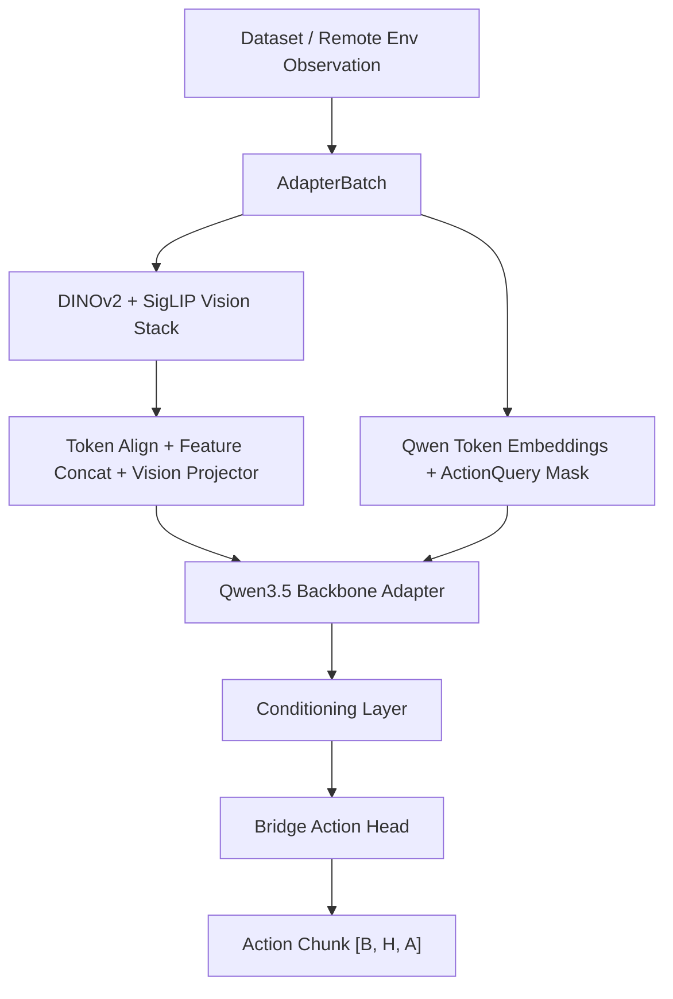

# VLA Adapter Framework Map

The framework is organized around adapter replacement, not RL rollout. The main
model path is:



## Public Package Layout

```text
prismatic_adapter/
|-- pipeline.py              # VLAAdapter: complete adapter pipeline
|-- adapters/                # model-specific public adapters
|   |-- base.py              # ModelAdapter protocol
|   |-- qwen_vit.py          # Qwen3.5 + DINOv2/SigLIP ViT example
|   `-- hf_prismatic.py      # Prismatic/OpenVLA-like HF adapter
|-- backbones/               # adapter implementation internals
|   `-- qwen_vit.py          # Qwen + TIMM fused vision implementation
|-- conditioning/            # hidden-state compatibility layer
|-- action_heads/            # continuous action heads
|-- datasets/                # AdapterBatch, SampleAdapter, LIBERO adapter
|-- training/                # trainer, optimizer, scheduler, LoRA, logging
|-- runtime/                 # inference and checkpoint helpers
|-- config.py                # adapter/policy/conditioning configs
|-- sequence.py              # token insertion and segment extraction
`-- types.py                 # shared dataclasses

vla_runtime/
|-- env_client.py            # ZMQ client
|-- policies/
|   |-- base.py              # RolloutPolicy protocol
|   `-- vla_adapter.py       # Remote obs -> AdapterBatch -> action chunk
|-- rollouts/                # action queue rollout loop
|-- runners/                 # eval runner
`-- recorder.py              # metrics / episode JSONL

env_process/
|-- protocols.py             # HELLO / LIST_TASKS / RESET / STEP / RENDER / CLOSE
|-- codecs.py                # numpy observation transport
|-- backends/
|   |-- fake.py              # smoke-test backend
|   `-- libero.py            # LIBERO backend skeleton
`-- clients/zmq_server.py    # environment-side ZMQ REP server
```

## DINOv2 + SigLIP Vision Stack

The concrete Qwen example uses two TIMM ViT towers by default:

```python
DEFAULT_VISION_BACKBONE_SPECS = (
    VisionBackboneSpec("vit_large_patch14_reg4_dinov2.lvd142m", image_size=518),
    VisionBackboneSpec("vit_so400m_patch14_siglip_224", image_size=224),
)
```

The stack is explicit and replaceable:

```text
image_primary / image_wrist
        |
        v
split views [B, V, C, H, W]
        |
        +--> DINOv2 tower  -- patch tokens [B, P1, D1]
        |
        `--> SigLIP tower  -- patch tokens [B, P2, D2]
                  |
                  v
        token alignment: interpolate | truncate | error
                  |
                  v
        concat features [B, P, D1 + D2]
                  |
                  v
        trainable vision_projector -> Qwen hidden size
```

This handles the practical compatibility issue: DINOv2 and SigLIP can have
different preferred input sizes and different patch-token counts. The adapter
normalizes that into one `[B, P, hidden]` token stream before inserting it into
the Qwen sequence.

Training and eval scripts expose:

```bash
--vision-model-ids vit_large_patch14_reg4_dinov2.lvd142m,vit_so400m_patch14_siglip_224
--vision-image-sizes 518,224
--vision-token-align interpolate
--vision-cache-dir pretrained_models/vision_cache/hf
```

## Replacement Contract

To replace the backbone, implement `ModelAdapter.forward_with_action_queries`.
Everything after that point is model-agnostic.

To replace the action head, keep the condition tensor contract:

```python
raw_tokens:          [B, L, R, D]
action_query_tokens: [B, L, Q, D]
proprio_token:       [B, 1, D] or None
```

To replace a dataset, emit `AdapterBatch` with a valid `action_mask`. The core
pipeline does not know RLDS, LIBERO, CALVIN, or robot-specific field names.
