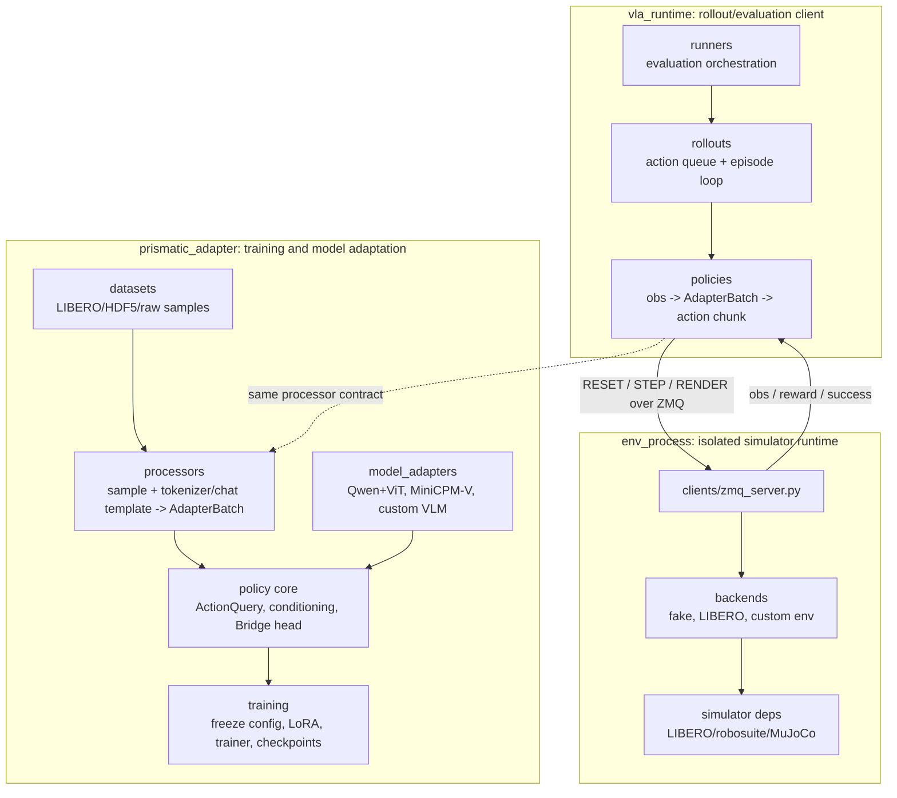

# VLA Adapter Framework Map

The project is organized around model replacement. Training, rollout, and the
environment process are deliberately separate so a new VLM can be adapted
without rewriting LIBERO communication or the Bridge action policy.



## Public Layout

```text
prismatic_adapter/
|-- processors/          # tokenizer/chat-template/image/proprio -> AdapterBatch
|   |-- standard.py      # simple tokenizer + tensor images, used by Qwen+ViT
|   `-- minicpm.py       # MiniCPM-V chat template + image processor
|-- model_adapters/      # preferred public namespace for VLM adapters
|   |-- base.py          # ModelAdapter / BackboneAdapter protocol
|   |-- qwen_vit.py      # Qwen3.5 + DINOv2/SigLIP example
|   `-- minicpm.py       # MiniCPM-V example
|-- adapters/            # compatibility namespace for older imports
|-- backbones/           # compatibility/internal implementation namespace
|-- components/          # ActionQuery, conditioning, prompt/action utilities
|-- action_heads/        # Bridge continuous action head
|-- datasets/            # LIBERO HDF5 and RLDS storage adapters
|-- training/            # trainer, optimizer, scheduler, LoRA, logging
|-- config_loader.py     # YAML -> argparse defaults for scripts
|-- config.py            # adapter/policy/trainable configs
|-- sequence.py          # token insertion and segment extraction
`-- types.py             # AdapterBatch, BackboneOutput, SegmentSlices

vla_runtime/
|-- env_client.py
|-- policies/
|-- rollouts/
|-- runners/
`-- recorder.py

env_process/
|-- protocols.py
|-- codecs.py
|-- backends/
`-- clients/zmq_server.py
```

## Replacement Contract

To add another VLM, implement two small pieces:

1. `processors/<model>.py`
   Converts raw observations and an instruction into `AdapterBatch`. This is
   where tokenizer quirks, chat templates, image processors, and special image
   token layouts belong.

2. `model_adapters/<model>.py`
   Implements `ModelAdapter.forward_with_action_queries(batch, action_queries)`
   and returns `BackboneOutput(hidden_states, segments, fused_attention_mask)`.
   Everything after that point is shared by Qwen, MiniCPM, and future models.

The shared policy handles:

- hidden-size projection into the policy dimension;
- different language-model layer counts through `LayerSelector`;
- different visual token counts through token compression;
- train/freeze switches through `TrainableConfig`;
- optional LoRA through `training.optim.apply_lora`.

## Built-In Examples

```text
Qwen3.5 + DINOv2/SigLIP
  StandardBatchProcessor
  QwenTimmVLAAdapter
  configs/train_libero_qwen35_vit.example.yaml

MiniCPM-V
  MiniCPMVBatchProcessor
  MiniCPMVLAAdapter
  configs/train_libero_minicpm_v.example.yaml

Data sources
  LiberoHdf5Dataset
  RldsTfdsDataset
  configs/train_rlds_qwen35_vit.example.yaml
```

The Qwen example owns a fused TIMM vision stack:

```text
image_primary / image_wrist
  -> DINOv2 tower + SigLIP tower
  -> token alignment: interpolate | truncate | error
  -> vision projector
  -> Qwen hidden states
```

The MiniCPM example lets the native MiniCPM processor build multimodal inputs,
then only appends ActionQuery placeholders and exposes the hidden-state
segments needed by the Bridge policy.
