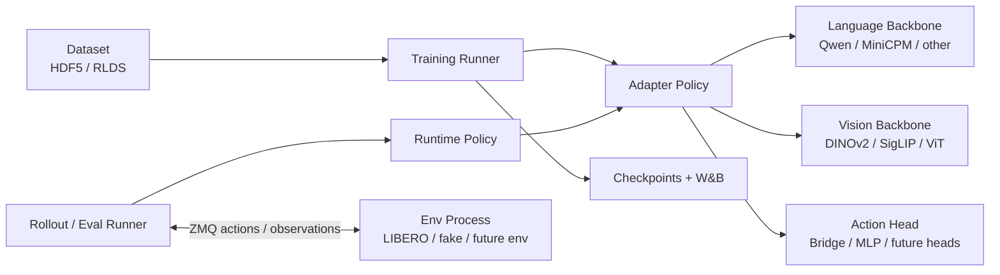

# Modular VLA Adapter Project Handoff

本文档用于给后续接手的工程师或大模型快速理解当前任务：我们正在构建一个**易于替换语言模型、视觉模型、数据格式和评估环境的 VLA adapter 框架**。核心目标不是复刻某个固定模型，而是把 Prismatic/VLA adapter 的训练、数据、模型骨干、action head、rollout/eval 环境拆成清晰接口，方便换 Qwen、MiniCPM、DINOv2、SigLIP、LIBERO HDF5/RLDS 等组件。

## 1. 当前目标

当前阶段的目标是：

- 用 Qwen3.5 作为语言骨干，DINOv2/SigLIP 或标准 ViT 作为视觉骨干，训练 LIBERO-Object adapter。
- 同时保留 MiniCPM-V 等其他大模型接入路径，证明框架不是单模型脚本。
- 支持 HDF5 和 RLDS/TFDS 两类数据输入，并通过配置选择。
- 把评估环境作为独立进程，通过 ZMQ 或类似消息接口连接 rollout，避免 Python 环境冲突。
- 在 32GB 级别 GPU 上先跑通 smoke training，再逐步扩展训练规模。

## 2. 当前进度

已经完成：

- 框架拆分：
  - `prismatic_adapter/`：模型、数据、训练、配置、action head、sequence conditioning。
  - `vla_runtime/`：policy wrapper、rollout、runner、recorder。
  - `env_process/`：独立环境进程、ZMQ 协议、fake/LIBERO backend skeleton。
- 模型适配：
  - Qwen3.5 + timm vision adapter：`prismatic_adapter/backbones/qwen_vit.py`。
  - MiniCPM-V adapter：`prismatic_adapter/model_adapters/minicpm.py`。
  - 视觉骨干支持通过配置选择 DINOv2、SigLIP、ViT/timm model id。
- 数据适配：
  - HDF5：`prismatic_adapter/datasets/libero_hdf5.py`。
  - RLDS/TFDS：`prismatic_adapter/datasets/rlds.py`。
  - 训练入口支持 `--dataset-format auto|factory|libero_hdf5|rlds`。
- 训练组件：
  - 通用 trainer、stepper、optimizer/scheduler、checkpoint、W&B logging。
  - LoRA、冻结语言骨干、冻结视觉骨干等开关已经配置化。
- 安全处理：
  - W&B API key 不写入仓库，只能走环境变量或 ignored 文件。
  - 大模型权重、LIBERO 数据、server-local 配置不提交。
- 已验证：
  - 单步 RLDS 训练可以跑到 W&B，项目名为 `Modular-vla-adapter`。
  - `USE_LORA=0 RAW_TOKEN_BUDGET=64 MAX_STEPS=1 bash scripts/server/train_libero_object_rlds.sh` 已经产生 train/loss 等日志。

当前主要问题：

- 32GB GPU 上完整 Qwen3.5 + dual vision + adapter 仍然容易 OOM。
- 已修复两个主要 OOM 点，但当前最新瓶颈出现在 action head / bridge FFN。
- 还缺正式 memory profiling 工具和 32GB smoke preset。

## 3. 框架结构

```text
modular-vla-adapter/
+-- prismatic_adapter/
|   +-- backbones/          # Qwen + vision 等底层 backbone 实现
|   +-- model_adapters/     # 不同大模型的适配入口
|   +-- processors/         # 图像、文本、动作预处理
|   +-- datasets/           # HDF5、RLDS/TFDS 数据接口
|   +-- policy/             # action head / bridge / adapter policy
|   +-- training/           # trainer、step、checkpoint、logging
|   +-- components/         # projector、query、normalizer 等可替换部件
|   +-- sequence.py         # hidden state 抽取和 token 压缩
|   +-- config.py           # adapter config dataclass
|   +-- config_loader.py    # YAML/CLI 配置加载
+-- vla_runtime/
|   +-- env_client.py       # rollout 侧环境客户端
|   +-- policies/           # policy wrapper
|   +-- rollouts/           # trajectory collection
|   +-- runners/            # train/eval orchestration
|   +-- recorder.py
+-- env_process/
|   +-- server.py           # 独立环境进程入口
|   +-- protocols.py        # reset/step/render/success 消息协议
|   +-- codecs.py           # numpy/image/action 编解码
|   +-- backends/
|       +-- fake.py         # 本地 smoke backend
|       +-- libero.py       # LIBERO backend skeleton
+-- scripts/
|   +-- train_qwen35_vit.py
|   +-- train_minicpm_v.py
+-- configs/
|   +-- *.example.yaml      # 可开源示例配置
+-- docs/
```

大板块关系：



## 4. 核心接口思路

### 4.1 大模型适配

不同语言模型不要直接改训练脚本，而是通过 adapter 封装：

- tokenizer/chat template/token embedding 由 processor 或 model adapter 处理。
- hidden states 通过统一输出格式交给 `HiddenStateExtractor`。
- action query、vision token、text token 的拼接逻辑留在 backbone adapter。
- 训练脚本只负责读配置并调用统一 `PrismaticAdapterPolicy`。

当前 Qwen 路径：

- `scripts/train_qwen35_vit.py`
- `prismatic_adapter/backbones/qwen_vit.py`
- `prismatic_adapter/model_adapters/qwen_vit.py`

当前 MiniCPM 路径：

- `scripts/train_minicpm_v.py`
- `prismatic_adapter/model_adapters/minicpm.py`
- `prismatic_adapter/processors/minicpm.py`

### 4.2 视觉模型适配

视觉骨干应该可配置：

- `vision_model_ids`：例如 DINOv2 + SigLIP。
- `vision_pretrained`：是否加载预训练。
- `vision_cache_dir`：本地权重缓存目录。
- `train_vision_backbone`：是否训练视觉塔。

后续建议把视觉 forward 抽成更明确的 `VisionEncoder` 接口：

- `encode_images(batch) -> VisionFeatures`
- `output_dim`
- `patch_count`
- `freeze()` / `unfreeze()`
- `enable_gradient_checkpointing()`

这样替换 DINOv2、SigLIP、CLIP、EVA、InternViT 时，不需要改 Qwen adapter 主逻辑。

### 4.3 数据输入适配

官方常用 RLDS 的原因：

- TensorFlow Datasets/RLDS 对机器人轨迹数据支持成熟，适合多任务、多 episode、大规模 streaming。
- OpenVLA/LIBERO 等数据发布经常使用 RLDS，便于复用官方 pipeline。
- HDF5 更轻量，适合本地调试、少量数据和快速 smoke test。

当前框架已经同时支持：

- `libero_hdf5`
- `rlds`
- `auto`

后续不要把数据解析逻辑塞进训练脚本，新增格式应实现统一 dataset factory，输出统一 batch 字段：

- `images`
- `input_ids` / text fields
- `actions`
- `proprio`
- `task_description`
- `metadata`

### 4.4 环境进程适配

我们采用类似“环境服务器”的结构，但不一定是真 HTTP server：

- 训练/评估进程只发 `reset/step/render/success` 请求。
- LIBERO 或其他环境运行在独立 Python 环境中。
- 两侧通过 ZMQ 传输 observation、action、reward、done、success 等结构。

好处：

- 解决 LIBERO、MuJoCo、robosuite、PyTorch、TensorFlow 版本冲突。
- rollout/eval 逻辑可以复用同一个 runtime。
- 后续接真实机器人或其他仿真器时，只需要替换 backend。

## 5. 服务器训练流程

推荐服务器路径：

```bash
cd /home/ubuntu/xutian/zihang/modular-vla/modular-vla-adapter
conda activate vla-adapter
```

LIBERO-Object RLDS smoke：

```bash
USE_LORA=0 RAW_TOKEN_BUDGET=64 MAX_STEPS=1 bash scripts/server/train_libero_object_rlds.sh
```

更长 smoke：

```bash
USE_LORA=0 RAW_TOKEN_BUDGET=64 MAX_STEPS=10 bash scripts/server/train_libero_object_rlds.sh
```

开启 W&B：

```bash
export WANDB_API_KEY=your_new_key
export WANDB_MODE=online
USE_LORA=0 RAW_TOKEN_BUDGET=64 MAX_STEPS=10 bash scripts/server/train_libero_object_rlds.sh
```

W&B 信息：

- Entity: `1carus-nju`
- Project: `Modular-vla-adapter`

注意：

- `scripts/server/` 是服务器本地 ignored 文件，不应提交。
- `configs/*.server.yaml` 是服务器私有配置，不应提交。
- 预训练权重、LIBERO 数据、W&B key 都不应提交。

## 6. 当前 OOM 分析

已经遇到并处理过三类显存问题。

### 6.1 Qwen full logits OOM

现象：

- OOM 出现在 Qwen `lm_head`。
- 语言模型即使不训练 token loss，也会对全序列输出完整 vocab logits。

处理：

- adapter 训练不需要语言 token logits。
- 当 `labels is None` 时，Qwen forward 传入空 `logits_to_keep`，跳过大 vocab logits。
- 对应位置：`prismatic_adapter/backbones/qwen_vit.py`。

### 6.2 Raw hidden tokens 拼接 OOM

现象：

- OOM 出现在 `HiddenStateExtractor` 的 `torch.cat(raw_layers, dim=1)`。
- 多层 hidden state、视觉 token、文本 token、action query 全部拼接，显存峰值很高。

处理：

- 新增 `raw_token_budget`，每层先 mean-pool 压缩 raw tokens，再拼接。
- 对应位置：`prismatic_adapter/sequence.py`。

### 6.3 Bridge FFN OOM

现象：

- 最新 OOM 出现在 `prismatic_adapter/policy/bridge.py` 的 FFN。
- 只差几十 MB 也 OOM，说明前面 Qwen + vision + hidden extraction 已经把显存压到极限，Bridge 只是最后触发点。

初步判断：

- 不是单纯某一行写错，而是整体激活保存太多。
- 当前 `trainable parameters: 415,031,327`，对 smoke 来说偏大。
- 即使 `USE_LORA=0`，action head、projector、conditioning、action queries 等仍然可训练。

## 7. 如何实际检测各部分显存

下一步应实现正式 memory profiler，而不是只看 OOM 栈。

建议在训练 step 中记录：

- batch move to GPU 后。
- vision encoder 后。
- language backbone 后。
- hidden extractor 后。
- projector/conditioner 后。
- action head 后。
- loss 后。
- backward 后。
- optimizer step 后。

记录指标：

- `torch.cuda.memory_allocated()`
- `torch.cuda.memory_reserved()`
- `torch.cuda.max_memory_allocated()`
- `torch.cuda.max_memory_reserved()`

建议新增 CLI：

```bash
--memory-profile
--memory-profile-steps 2
--memory-profile-sync
```

输出示例：

```text
[mem] after_batch          allocated=12.4GB reserved=13.1GB peak=13.5GB
[mem] after_backbone       allocated=24.8GB reserved=26.0GB peak=27.2GB
[mem] after_hidden_extract allocated=27.3GB reserved=28.1GB peak=29.0GB
[mem] after_action_head    allocated=30.1GB reserved=30.8GB peak=31.0GB
```

也可以同步写入 W&B：

- `memory/allocated_gb`
- `memory/reserved_gb`
- `memory/peak_allocated_gb`
- `memory/stage`

## 8. 下一步优化方案

### P0: 先做可观测性

必须先加 memory profiler，否则只能根据 OOM 栈猜。

建议改动：

- 新增 `prismatic_adapter/training/memory.py`。
- 在 `TrainingStepper` 或 `Trainer.fit` 中插入阶段标记。
- 支持只 profile 前 N step，避免长期拖慢训练。
- W&B 和 stdout 都记录。

验收：

- `MAX_STEPS=1 --memory-profile` 可以打印每个阶段显存。
- 不改变默认训练行为。

### P1: 做 32GB smoke preset

目标是在 31-32GB GPU 上稳定跑 10 step。

建议配置：

- `USE_LORA=0`
- `RAW_TOKEN_BUDGET=32` 或 `64`
- `policy_hidden_size=512`
- `num_condition_layers=8`
- `policy_num_layers` 降低到 smoke 级别。
- `gradient_accumulation_steps` 提高，真实 batch size 保持 1。
- 先用单视觉塔或更小图像尺寸验证 pipeline。

验收：

- `MAX_STEPS=10` 不 OOM。
- W&B 有连续 loss 曲线。
- 输出 checkpoint。

### P2: 冻结视觉塔时减少激活

如果 `train_vision_backbone=False`，视觉塔不需要保存梯度。

建议：

- vision encoder forward 使用 `torch.no_grad()`。
- 输出 vision features 后再进入 trainable projector。
- 注意：projector 仍然要保留梯度。

验收：

- frozen vision 下显存明显下降。
- projector 参数仍有梯度。

### P3: Qwen gradient checkpointing

即使 Qwen 冻结，action query 和 vision projector 仍可能需要通过 Qwen 反传，所以不能简单把整个 Qwen `no_grad`。

建议：

- 支持 `--language-gradient-checkpointing`。
- 设置 `language_model.config.use_cache = False`。
- 对 LoRA 或需要输入梯度的路径启用 checkpoint。

验收：

- 显存下降，速度变慢但可接受。
- LoRA on/off 均能 forward/backward。

### P4: Action head / Bridge 瘦身和 checkpoint

最新 OOM 在 Bridge FFN，需要把 action head 变成更明确可配。

建议配置化：

- `policy_hidden_size`
- `policy_num_layers`
- `policy_num_heads`
- `ffn_multiplier`
- `dropout`
- `condition_layers`
- `raw_token_budget`

进一步优化：

- 对 Bridge block 使用 activation checkpoint。
- 减少 cross-attention 输入 token。
- 支持 lightweight head 用于 smoke。

验收：

- 32GB smoke preset trainable params 明显低于当前 415M。
- `MAX_STEPS=10` 稳定。

## 9. 推荐实验顺序

不要直接上最大模型完整训练。建议按下面顺序推进：

| 阶段 | 目标 | 命令/配置 | 通过标准 |
| --- | --- | --- | --- |
| 0 | 环境检查 | `python -m pytest tests` | 单测通过 |
| 1 | 数据检查 | `MAX_STEPS=1 USE_LORA=0` | 能读 RLDS batch |
| 2 | 显存定位 | `MAX_STEPS=1 --memory-profile` | 有阶段显存表 |
| 3 | 32GB smoke | `MAX_STEPS=10 USE_LORA=0 RAW_TOKEN_BUDGET=32` | 不 OOM |
| 4 | LoRA smoke | `MAX_STEPS=10 USE_LORA=1` | 不 OOM，有 loss |
| 5 | 中等训练 | `MAX_STEPS=1000` | checkpoint 和 W&B 正常 |
| 6 | eval smoke | env process + fake/LIBERO backend | reset/step/success 正常 |
| 7 | 正式训练 | full schedule | loss 稳定下降 |

## 10. 后续实现清单

优先实现：

- [ ] `prismatic_adapter/training/memory.py`：显存 profile 工具。
- [ ] 训练 CLI 增加 `--memory-profile`。
- [ ] frozen vision forward 使用 no_grad。
- [ ] Qwen gradient checkpointing 配置。
- [ ] action head 参数完全 YAML/CLI 化。
- [ ] 32GB smoke example config。

中期实现：

- [ ] `VisionEncoder` 抽象接口，减少 Qwen adapter 与 timm 绑定。
- [ ] `LanguageBackboneAdapter` 抽象接口，统一 Qwen/MiniCPM/其他模型。
- [ ] `DatasetFactory` registry，统一 HDF5/RLDS/未来数据格式。
- [ ] env process 的 LIBERO backend 从 skeleton 扩展为可跑 eval。
- [ ] rollout metrics 接入 W&B。

长期实现：

- [ ] 多任务 LIBERO 数据混合。
- [ ] checkpoint resume 和 adapter-only save/load。
- [ ] 推理时 action normalization/denormalization 配置化。
- [ ] 真实机器人或其他仿真环境 backend。
- [ ] 开源 README 增加完整 quickstart。

## 11. 安全和开源边界

可以提交：

- 框架代码。
- 示例配置。
- 文档。
- 单元测试。
- 不含真实路径/密钥的模板脚本。

不要提交：

- W&B API key。
- `wandb.env`。
- `secrets/`。
- 模型权重。
- LIBERO 数据。
- 服务器私有路径配置。
- `outputs/`、`wandb/`、checkpoint。

提交前检查：

```bash
git status --short
git diff --cached
git grep -n "wandb.*key\|WANDB_API_KEY\|api_key"
```

如果曾经把 secret 推进历史，需要 rotate key，并通过 GitHub secret scanning / history rewrite 策略处理。当前新的 key 已经更换，后续仍要避免在任何 commit 中出现。

## 12. 给后续接手者的建议

后续不要先大改结构。最有效的路线是：

1. 先加 memory profiler，把真实显存分布量出来。
2. 根据 profile 决定是 vision、Qwen、hidden extraction 还是 bridge 占用最大。
3. 先做 32GB smoke preset，确保训练闭环稳定。
4. 再逐步打开 LoRA、dual vision、更大 raw token budget。
5. 最后才做完整 LIBERO-Object 训练和 env process evaluation。

当前框架已经具备“可替换模型”的基本形态，但还需要把 memory-aware training、vision/language adapter interface 和 eval backend 做得更完整，才能达到真正开源项目的成熟度。
