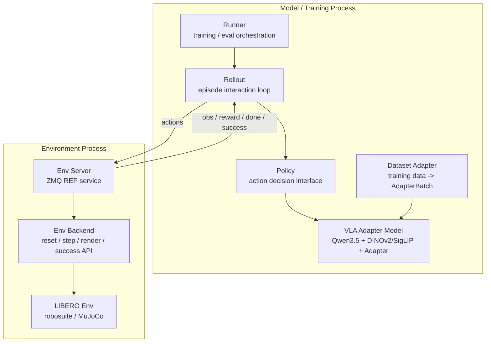
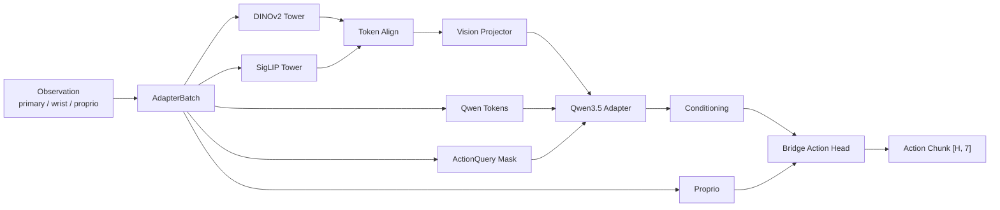

# VLA Adapter System Overview

This document describes the current VLA-Adapter framework at the level of major
modules, their relationships, and the standard ways to run local verification,
LIBERO evaluation, and training.

## Big Picture

The system is split into two major processes:

- **Model / training process**: owns the VLA adapter, Qwen3.5, DINOv2/SigLIP
  vision towers, training, rollout policy, and evaluation runner.
- **Environment process**: owns simulator dependencies such as LIBERO,
  robosuite, MuJoCo, task reset/step/render, and success checks.

The two processes communicate through ZMQ. This avoids putting Qwen/ViT
dependencies and simulator dependencies into the same runtime path.



## Module Responsibilities

```text
prismatic_adapter/
|-- adapters/            # model-specific adapters, including Qwen + ViT
|-- backbones/           # adapter implementation internals
|-- conditioning/        # hidden-state selection/projection/compression
|-- action_heads/        # continuous action decoder
|-- datasets/            # AdapterBatch, LIBERO sample/HDF5 dataset adapters
|-- training/            # trainer, optimizer, scheduler, LoRA, logging
|-- runtime/             # inference/checkpoint helpers
|-- config.py            # adapter configuration
|-- sequence.py          # vision/text/action-query token layout
`-- types.py             # shared data containers

vla_runtime/
|-- env_client.py        # ZMQ environment client
|-- policies/            # RolloutPolicy and VLAAdapterRolloutPolicy
|-- rollouts/            # action queue and episode loop
|-- runners/             # evaluation runner
`-- recorder.py          # episode JSONL and metrics

env_process/
|-- protocols.py         # message protocol
|-- codecs.py            # numpy array transport
|-- backends/
|   |-- fake.py          # dependency-light test backend
|   `-- libero.py        # LIBERO backend
`-- clients/
    `-- zmq_server.py    # environment-side server
```

## Model Architecture

The concrete example uses Qwen3.5 as the language backbone and a fused
DINOv2/SigLIP visual stack.



Default vision towers:

```python
VisionBackboneSpec("vit_large_patch14_reg4_dinov2.lvd142m", image_size=518)
VisionBackboneSpec("vit_so400m_patch14_siglip_224", image_size=224)
```

If the two towers produce different patch-token counts, the fused vision stack
can align them with:

```text
interpolate | truncate | error
```

The training and evaluation scripts expose this through:

```bash
--vision-model-ids
--vision-image-sizes
--vision-token-align
--vision-cache-dir
```

## Local Environment

The project-local conda environment is:

```text
E:\RL\VLA-adapter\.conda
```

Use it directly from PowerShell:

```powershell
.\.conda\python.exe -m pytest tests
.\.conda\python.exe -m ruff check prismatic_adapter vla_runtime env_process scripts examples tests
```

For LIBERO / robosuite on Windows, set:

```powershell
$env:MUJOCO_GL="wgl"
```

The local `.conda/`, `LIBERO/`, `outputs/`, and pretrained model folders are
ignored by git.

## Quick Framework Verification

Use the fake environment when you want to verify the communication path without
LIBERO or large models.

Terminal A:

```powershell
.\.conda\python.exe scripts\serve_fake_env.py `
  --endpoint tcp://127.0.0.1:5555 `
  --max-steps 3
```

Terminal B:

```powershell
.\.conda\python.exe scripts\eval_with_remote_env.py `
  --endpoint tcp://127.0.0.1:5555 `
  --output-dir outputs\remote_eval_smoke
```

To verify the model-side adapter path without loading Qwen3.5, DINOv2, or
SigLIP, run:

```powershell
.\.conda\python.exe examples\tiny_adapter_remote_eval.py `
  --endpoint tcp://127.0.0.1:5555 `
  --output-dir outputs\tiny_adapter_remote_eval
```

This exercises:

```text
RemoteEnvClient -> ObservationBatchBuilder -> VLAAdapter -> action chunk -> env.step
```

## LIBERO Evaluation Backend

The copied `LIBERO/` directory contains the benchmark package and evaluation
resources:

- `bddl_files`
- `init_files`
- `assets`
- benchmark task definitions

It does not contain `.hdf5/.h5` demonstration data for training.

Start the LIBERO environment server:

```powershell
$env:MUJOCO_GL="wgl"
.\.conda\python.exe scripts\serve_libero_env.py `
  --endpoint tcp://127.0.0.1:5555 `
  --libero-root E:\RL\VLA-adapter\LIBERO `
  --task-suite libero_object `
  --resolution 64
```

The `--libero-root` argument creates a local writable LIBERO config under
`outputs/` and points LIBERO to the copied benchmark resources.

The server exposes:

```text
HELLO
LIST_TASKS
RESET
STEP
RENDER
CLOSE
```

## Qwen3.5 + DINOv2/SigLIP Evaluation

Download the default DINOv2 and SigLIP TIMM weights from the Hugging Face
mirror into the project-local pretrained model cache:

```powershell
.\.conda\python.exe scripts\download_vision_backbones.py `
  --cache-dir pretrained_models\vision_cache `
  --hf-endpoint https://hf-mirror.com
```

If the standard Hugging Face cache metadata request fails, the downloader falls
back to direct mirror `resolve/main/model.safetensors` downloads and stores the
files under:

```text
pretrained_models/vision_cache/files/<timm-model-id>/model.safetensors
```

The model scripts use this cache by default through:

```powershell
--vision-cache-dir pretrained_models\vision_cache\hf
```

After a checkpoint exists, connect the model process to a running environment
server:

```powershell
.\.conda\python.exe scripts\eval_qwen35_vit_remote.py `
  --endpoint tcp://127.0.0.1:5555 `
  --qwen-path pretrained_models\Qwen3.5-2B `
  --checkpoint outputs\qwen35_vit_libero_object\latest.pt `
  --action-stats-json path\to\action_stats.json `
  --vision-pretrained `
  --vision-cache-dir pretrained_models\vision_cache\hf `
  --task-limit 1
```

Use `--vision-pretrained` when DINOv2/SigLIP TIMM weights are already available
in the local cache.

## Training Entry

Training can use either an external dataset factory or the built-in LIBERO HDF5
factory. For LIBERO HDF5 demonstrations, first prepare action stats:

```powershell
.\.conda\python.exe scripts\prepare_libero_hdf5.py `
  --root data\libero `
  --output-json outputs\libero_action_stats.json `
  --sample-check
```

Then start training:

```powershell
.\.conda\python.exe scripts\train_qwen35_vit.py `
  --libero-hdf5-root data\libero `
  --action-stats-json outputs\libero_action_stats.json `
  --qwen-path pretrained_models\Qwen3.5-2B `
  --vision-pretrained `
  --vision-cache-dir pretrained_models\vision_cache\hf `
  --use-lora `
  --output-dir outputs\qwen35_vit_libero_object
```

The factory may return:

```python
train_dataset
(train_dataset, val_dataset)
{"train": train_dataset, "val": val_dataset}
```

Each item should be an `AdapterBatch`. For LIBERO-style records, use
`LiberoSampleAdapter` or `LiberoHdf5Dataset` from `prismatic_adapter.datasets`.

Fine-grained train/freeze switches are exposed by `TrainableConfig` and the
training CLI:

```text
language model | vision backbone | vision projector | action queries
conditioning | action head | proprio projector
```

## Current Verification Status

Verified in the project-local `.conda` environment:

- unit tests: `13 passed`
- ruff: passed
- Qwen tokenizer import/load: passed
- TIMM import: passed
- DINOv2/SigLIP cache path support: implemented
- LIBERO benchmark task listing: passed
- LIBERO reset with offscreen render env: passed
- LIBERO ZMQ server `HELLO/LIST_TASKS/RESET/STEP/CLOSE`: passed

Remaining for full experiment reproduction:

- obtain real LIBERO demonstration `.hdf5/.h5` data for training
- train or load an adapter checkpoint
- run full Qwen3.5 + DINOv2/SigLIP evaluation against LIBERO tasks
